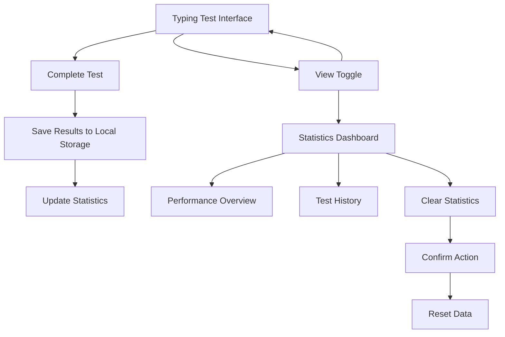

## 1. Product Overview
Typing Statistics Enhancement for Typoria - A comprehensive performance tracking system that records and analyzes user typing performance over time using local storage for data persistence.

The enhancement adds detailed statistics tracking to help users monitor their typing improvement, identify patterns, and set performance goals. All data is stored locally in the browser for privacy and offline access.

## 2. Core Features

### 2.1 User Roles
No specific user roles required - the statistics system works for both authenticated and anonymous users, with data stored locally per browser session.

### 2.2 Feature Module
Our typing statistics enhancement consists of the following main components:
1. **Statistics Dashboard**: comprehensive performance overview, historical data visualization, improvement trends.
2. **Real-time Performance Display**: live WPM tracking, accuracy calculation, session statistics.
3. **Data Persistence Layer**: local storage management, user-specific data isolation, data export capabilities.
4. **View Toggle Interface**: seamless switching between typing test and statistics views.

### 2.3 Page Details

| Page Name | Module Name | Feature description |
|-----------|-------------|---------------------|
| Statistics Dashboard | Performance Overview Cards | Display key metrics including average WPM, best WPM, average accuracy, and total typing time with trend indicators |
| Statistics Dashboard | Detailed Performance Summary | Show comprehensive stats including total tests completed, best accuracy, characters typed, total errors, and error rate |
| Statistics Dashboard | Recent Test History | List last 5 typing test results with date, language, WPM, accuracy, and duration |
| Statistics Dashboard | Statistics Management | Clear all statistics functionality with confirmation dialog |
| Typing Test Interface | Real-time Stats Display | Show current WPM, accuracy, and progress during typing sessions |
| Typing Test Interface | Test Completion Tracking | Automatically save test results when time expires or test completes |
| Navigation Interface | View Toggle | Switch between typing test and statistics dashboard views |
| Data Management | Local Storage Persistence | Store and retrieve typing statistics using browser local storage |
| Data Management | User Data Isolation | Separate statistics for different users (authenticated vs anonymous) |

## 3. Core Process

**Main User Flow:**
Users start on the typing test interface where they can see real-time performance metrics. When a test completes, results are automatically saved to local storage. Users can switch to the statistics dashboard to view comprehensive performance analytics, track improvement over time, and manage their data.

**Statistics Tracking Flow:**
Each completed typing test generates a detailed result record including WPM, accuracy, test duration, language, character count, and error count. This data is stored locally and used to calculate aggregate statistics and improvement trends.

## 4. User Interface Design

### 4.1 Design Style
- **Primary Colors**: Consistent with existing Typoria theme (dark/light mode support)
- **Button Style**: Rounded corners with subtle shadows, consistent with existing UI components
- **Font**: System fonts (Geist Sans/Mono) matching the current design
- **Layout Style**: Card-based design with clean spacing and clear visual hierarchy
- **Icons**: Lucide React icons for consistency (BarChart3, Target, Clock, TrendingUp, etc.)

### 4.2 Page Design Overview

| Page Name | Module Name | UI Elements |
|-----------|-------------|-------------|
| Statistics Dashboard | Performance Cards | Grid layout with 4 metric cards showing WPM, accuracy, and time stats with colored icons and trend indicators |
| Statistics Dashboard | Summary Card | Detailed performance metrics in a structured list format with separators and badges |
| Statistics Dashboard | Recent Tests Card | Chronological list of test results with date stamps, language badges, and performance metrics |
| Typing Test Interface | Stats Display | Inline performance indicators showing current WPM, word count, and timer in the existing button layout |
| Navigation | View Toggle | Segmented control with keyboard and chart icons for switching between typing and statistics views |

### 4.3 Responsiveness
The statistics dashboard is designed mobile-first with responsive grid layouts that adapt from single column on mobile to multi-column on desktop. All components maintain usability across different screen sizes while preserving the clean, modern aesthetic of the existing application.
